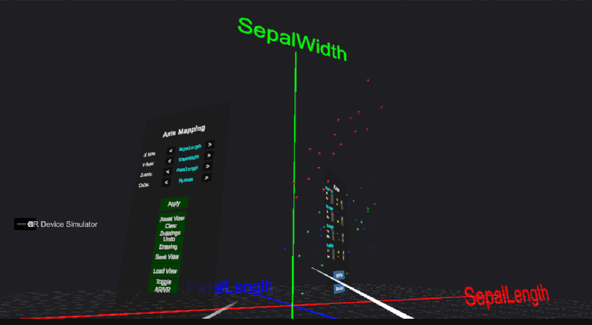
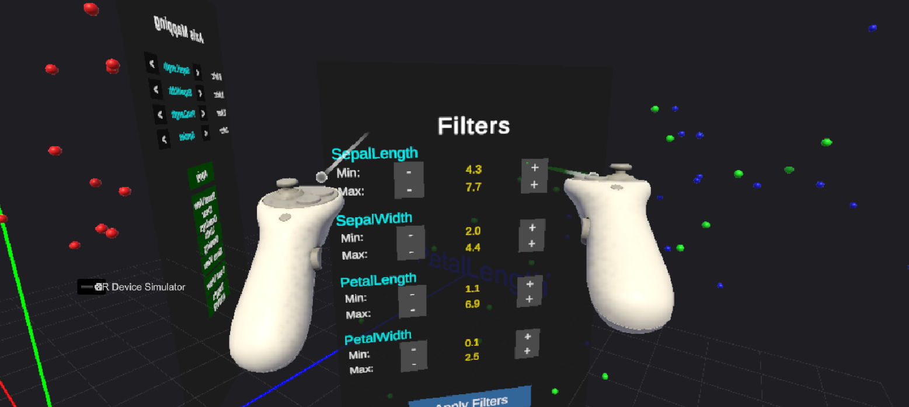
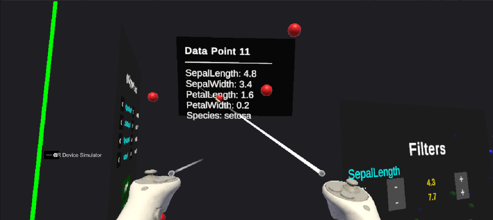
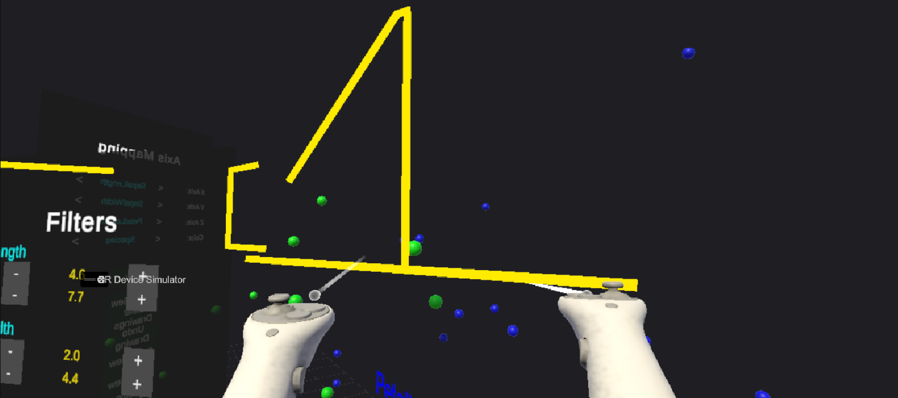

# VR DataViz - Immersive 3D Data Explorer

A universal CSV data visualization tool for Meta Quest built with Unity and OpenXR. Transform any spreadsheet data into interactive 3D scatter plots in Virtual and Augmented Reality.

## Purpose

Traditional 2D charts struggle to represent relationships in multi-dimensional data. VR DataViz solves this by mapping data to 3D space where users can physically walk around their data, grab and reposition visualizations, and annotate insights directly in space.

Built as a portfolio project demonstrating XR development, data visualization, and interactive system design.


## Screenshots

### Data Visualization Overview


### Axis Mapping Controls


### Hover Tooltip


### 3D Annotations



## Features

### Data Visualization
- Load any CSV with automatic numeric vs categorical column detection
- Dynamically map columns to X, Y, Z spatial axes
- Color encoding with gradients for numeric data and distinct colors for categories
- Axis labels update to reflect mapped column names
- Normalized scaling ensures all data fits within viewable bounds

### VR Interaction
- Hover tooltips display all column values for any data point
- Grab and reposition the entire visualization in space
- Real-time filtering with min/max range controls per column
- Reset view returns visualization to original position

### Annotation System
- Draw 3D annotations directly around data points
- Annotations are parented to visualization and move with it
- Undo last drawing or clear all annotations
- Drawings persist through save/load

### View Management
- Save complete state: position, axis mapping, filters, annotations
- Load previously saved views
- Toggle between VR mode and AR passthrough

## Technical Implementation

### Custom VR UI System
XR Interaction Toolkit had compatibility issues with Unity 6, so I built a custom solution using physics raycasts to detect canvas hits, then GraphicRaycaster to find specific UI elements. This handles hover states, click events, and proper button interactions.

### Local-Space Coordinate System
Annotations use local-space positioning relative to the visualization root. When users grab and move the visualization, all annotations move correctly. New drawings after repositioning still appear at the controller location relative to the moved coordinate system.

### Data Pipeline
CSV parsing handles quoted fields containing commas, missing values, and automatic type detection by sampling rows. Numeric columns store min/max for normalization. Categorical columns store unique values for color mapping.

## Demo Dataset

Includes Fisher's Iris dataset - a classic machine learning dataset with 150 samples of 3 flower species. When visualized with Petal Length, Petal Width, and Sepal Length on axes and Species as color, three distinct clusters emerge demonstrating the natural groupings in the data.

## Tech Stack

- Unity 6 (6000.x)
- OpenXR
- XR Interaction Toolkit
- C#
- Meta Quest 2/3/3S/Pro

## Project Structure
```
Scripts/
  Core/
    CSVParser.cs           - Parses CSV with quote handling
    DataSet.cs             - Column analysis and normalization
    DataManager.cs         - Singleton data loader
    SaveLoadManager.cs     - JSON serialization of view state
    ARToggle.cs            - VR/AR mode switching

  Visualization/
    CoordinateSystem.cs    - 3D axes, grid lines, labels
    PointCloudRenderer.cs  - Generates colored data points

  Interaction/
    VRUIPointer.cs         - Custom VR UI raycasting
    DataPointInteraction.cs- Hover detection and tooltips
    VisualizationGrabber.cs- Grab and move system
    VRDrawing.cs           - 3D line drawing

  UI/
    AxisMappingUI.cs       - Axis selection controls
    FilterPanel.cs         - Data range filtering
```

## Architecture Decisions

**Singleton Pattern** for DataManager and SaveLoadManager provides global access to shared state without tight coupling.

**Event-Driven Loading** using C# events (OnDataLoaded) allows visualization and UI components to react to data changes without direct dependencies.

**Component Composition** keeps each script focused on one responsibility. Interaction behaviors are separate components attached to controllers.

**Local Space Rendering** for LineRenderers ensures annotations move correctly with parent transforms rather than staying fixed in world space.

## Controls

| Action | Quest Controller | Editor Simulator |
|--------|------------------|------------------|
| Point and Select | Aim + Trigger | Mouse + Left Click |
| Grab Visualization | Grip Button | G Key |
| Draw Annotation | Trigger (hold) | F Key (hold) |
| Move | Thumbstick | WASD |

## Installation

1. Clone repository
2. Open in Unity 6
3. Open Assets/Scenes/DataVizMainScene
4. Build to Quest or test with XR Device Simulator

## Loading Custom Data

1. Place CSV file in Assets/StreamingAssets/
2. Select DataManager in Hierarchy
3. Change Default File Name to your file
4. CSV must have headers in first row

## Future Enhancements

- Multi-user collaboration for shared data exploration
- Voice commands for hands-free axis selection
- ML integration showing PCA or clustering results
- Support for larger datasets with LOD system

## Author

Anjali Kan

LinkedIn: https://www.linkedin.com/in/anjali-kanvinde

Portfolio: https://anjali-kanvinde.vercel.app/

GitHub: https://github.com/Anjali-Kan


## License

MIT